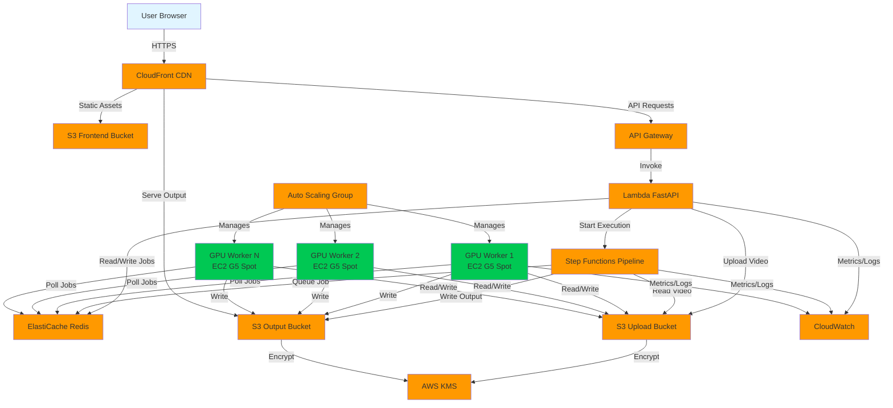
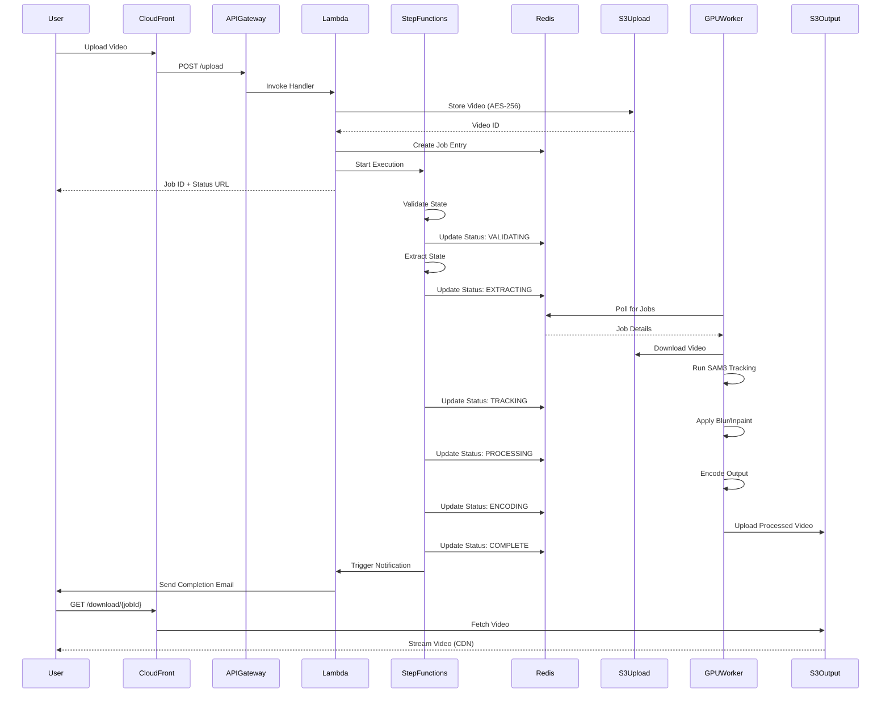

# Design Document: TapMask AI

## Overview

TapMask AI is a serverless, cloud-native video processing platform that enables professional-grade object tracking and masking through a single-click interface. The system architecture leverages AWS services to provide a scalable, cost-effective solution for video privacy protection and content removal.

The platform consists of five primary layers:

1. **Presentation Layer**: React-based frontend with interactive video player
2. **API Layer**: AWS Lambda functions behind API Gateway for request handling
3. **Orchestration Layer**: AWS Step Functions managing the processing pipeline
4. **Compute Layer**: EC2 G5 Spot Instances with NVIDIA A10G GPUs for ML workloads
5. **Storage Layer**: S3 for video storage with CloudFront for content delivery

The design prioritizes cost optimization through Spot Instances (70% cost reduction), automatic scaling (1 to 10,000 concurrent users), and security through encryption and GDPR compliance.

## Architecture

### System Architecture Diagram



### Processing Pipeline Sequence Diagram



## Components and Interfaces

### Frontend Component (React + TypeScript)

**Purpose**: Provide interactive video player and user interface for segmentation point selection.

**Technology Stack**:
- React 18 with TypeScript
- Plyr.js for video player
- Axios for API communication
- TailwindCSS for styling

**Key Interfaces**:

```typescript
interface VideoUploadRequest {
  file: File;
  userId: string;
  tierType: 'free' | 'pro';
}

interface VideoUploadResponse {
  jobId: string;
  videoId: string;
  statusUrl: string;
}

interface SegmentationRequest {
  videoId: string;
  segmentationPoint: {
    x: number;
    y: number;
    frameNumber: number;
  };
  mode: 'privacy_blur' | 'magic_eraser';
}

interface JobStatusResponse {
  jobId: string;
  status: 'validating' | 'extracting' | 'tracking' | 'processing' | 'encoding' | 'complete' | 'failed';
  progress: number;
  downloadUrl?: string;
  errorMessage?: string;
}
```

**Component Responsibilities**:
- Render video player with click event handlers
- Capture segmentation point coordinates on user click
- Display visual feedback for selected points
- Poll job status endpoint every 2 seconds
- Display download link when processing completes

### API Gateway + Lambda (FastAPI)

**Purpose**: Handle HTTP requests and orchestrate backend operations.

**Technology Stack**:
- Python 3.11
- FastAPI framework
- Mangum adapter for Lambda compatibility
- Boto3 for AWS SDK
- Redis client for job queue

**Key Endpoints**:

```python
POST /api/v1/upload
  Request: multipart/form-data with video file
  Response: {jobId, videoId, statusUrl}
  Validates: file format, file size, user quota
  
POST /api/v1/segment
  Request: {videoId, segmentationPoint, mode}
  Response: {jobId, statusUrl}
  Validates: videoId exists, valid coordinates
  
GET /api/v1/status/{jobId}
  Response: {jobId, status, progress, downloadUrl}
  
GET /api/v1/download/{jobId}
  Response: CloudFront signed URL
  Validates: job complete, user owns job
  
DELETE /api/v1/video/{videoId}
  Response: {success: true}
  Validates: user owns video
```

**Lambda Function Configuration**:
- Memory: 1024 MB
- Timeout: 30 seconds
- Concurrency: 1000 (reserved)
- Environment Variables: REDIS_ENDPOINT, S3_UPLOAD_BUCKET, S3_OUTPUT_BUCKET, KMS_KEY_ID

### Step Functions Pipeline

**Purpose**: Orchestrate the video processing workflow with error handling and retries.

**State Machine Definition**:

```json
{
  "StartAt": "ValidateJob",
  "States": {
    "ValidateJob": {
      "Type": "Task",
      "Resource": "arn:aws:lambda:REGION:ACCOUNT:function:validate-job",
      "Retry": [
        {
          "ErrorEquals": ["States.ALL"],
          "IntervalSeconds": 2,
          "MaxAttempts": 3,
          "BackoffRate": 2.0
        }
      ],
      "Next": "ExtractFrames"
    },
    "ExtractFrames": {
      "Type": "Task",
      "Resource": "arn:aws:lambda:REGION:ACCOUNT:function:extract-frames",
      "Retry": [
        {
          "ErrorEquals": ["States.ALL"],
          "IntervalSeconds": 2,
          "MaxAttempts": 3,
          "BackoffRate": 2.0
        }
      ],
      "Next": "QueueForProcessing"
    },
    "QueueForProcessing": {
      "Type": "Task",
      "Resource": "arn:aws:lambda:REGION:ACCOUNT:function:queue-job",
      "Next": "WaitForCompletion"
    },
    "WaitForCompletion": {
      "Type": "Wait",
      "Seconds": 10,
      "Next": "CheckJobStatus"
    },
    "CheckJobStatus": {
      "Type": "Task",
      "Resource": "arn:aws:lambda:REGION:ACCOUNT:function:check-status",
      "Next": "IsComplete"
    },
    "IsComplete": {
      "Type": "Choice",
      "Choices": [
        {
          "Variable": "$.status",
          "StringEquals": "complete",
          "Next": "NotifyUser"
        },
        {
          "Variable": "$.status",
          "StringEquals": "failed",
          "Next": "HandleFailure"
        }
      ],
      "Default": "WaitForCompletion"
    },
    "NotifyUser": {
      "Type": "Task",
      "Resource": "arn:aws:lambda:REGION:ACCOUNT:function:notify-user",
      "End": true
    },
    "HandleFailure": {
      "Type": "Task",
      "Resource": "arn:aws:lambda:REGION:ACCOUNT:function:handle-failure",
      "End": true
    }
  }
}
```

**State Responsibilities**:
- **ValidateJob**: Check video format, user quota, segmentation point validity
- **ExtractFrames**: Extract video metadata (resolution, frame rate, duration)
- **QueueForProcessing**: Add job to Redis queue with priority
- **WaitForCompletion**: Poll interval for job status
- **CheckJobStatus**: Query Redis for current job state
- **NotifyUser**: Send completion email with download link
- **HandleFailure**: Log error, update job status, send error notification

### GPU Worker (EC2 G5 Spot Instance)

**Purpose**: Execute ML models (SAM3 and ProPainter) for video processing.

**Instance Configuration**:
- Instance Type: g5.xlarge (NVIDIA A10G GPU, 4 vCPUs, 16 GB RAM)
- AMI: Deep Learning AMI (Ubuntu 20.04)
- Spot Instance: Yes (70% cost savings)
- Auto Scaling: Min 1, Max 50, Target Queue Depth 10

**Software Stack**:
- CUDA 12.1
- PyTorch 2.1
- OpenCV 4.8
- FFmpeg 6.0
- SAM3 model weights
- ProPainter model weights

**Worker Process Flow**:

```python
while True:
    # Poll Redis for pending jobs
    job = redis_client.blpop('job_queue', timeout=5)
    
    if job is None:
        check_idle_timeout()
        continue
    
    job_data = json.loads(job[1])
    
    try:
        # Download video from S3
        video_path = download_from_s3(job_data['videoId'])
        
        # Extract frames
        frames = extract_frames(video_path, fps=30)
        
        # Run SAM3 tracking
        masks = sam3_track(
            frames=frames,
            point=job_data['segmentationPoint'],
            model=sam3_model
        )
        
        # Apply processing based on mode
        if job_data['mode'] == 'privacy_blur':
            processed_frames = apply_gaussian_blur(
                frames=frames,
                masks=masks,
                kernel_size=(99, 99)
            )
        else:  # magic_eraser
            processed_frames = propainter_inpaint(
                frames=frames,
                masks=masks,
                model=propainter_model
            )
        
        # Encode output video
        output_path = encode_video(
            frames=processed_frames,
            fps=job_data['originalFps'],
            resolution=job_data['originalResolution']
        )
        
        # Upload to S3
        output_url = upload_to_s3(output_path, job_data['jobId'])
        
        # Update job status
        redis_client.hset(
            f"job:{job_data['jobId']}",
            mapping={
                'status': 'complete',
                'outputUrl': output_url,
                'completedAt': datetime.utcnow().isoformat()
            }
        )
        
    except Exception as e:
        # Handle errors
        redis_client.hset(
            f"job:{job_data['jobId']}",
            mapping={
                'status': 'failed',
                'errorMessage': str(e),
                'failedAt': datetime.utcnow().isoformat()
            }
        )
        log_error(e, job_data)
```

**Auto Scaling Logic**:
- Scale Up: When Redis queue depth > 10 jobs
- Scale Down: When queue depth < 5 jobs AND worker idle > 5 minutes
- Spot Interruption Handling: Requeue job to Redis before termination

### Job Queue (ElastiCache Redis)

**Purpose**: Manage job state and coordinate between Lambda and GPU workers.

**Redis Data Structures**:

```
# Job Queue (List)
job_queue: [jobId1, jobId2, jobId3, ...]

# Job Details (Hash)
job:{jobId}:
  - videoId: string
  - userId: string
  - segmentationPoint: JSON string
  - mode: 'privacy_blur' | 'magic_eraser'
  - status: 'queued' | 'processing' | 'complete' | 'failed'
  - progress: 0-100
  - createdAt: ISO timestamp
  - startedAt: ISO timestamp
  - completedAt: ISO timestamp
  - outputUrl: string
  - errorMessage: string

# User Quota (Hash)
user:{userId}:quota:
  - monthlyCount: integer
  - resetDate: ISO timestamp
  - tierType: 'free' | 'pro'
```

**Redis Configuration**:
- Node Type: cache.r6g.large (2 vCPUs, 13.07 GB RAM)
- Engine: Redis 7.0
- Replication: Multi-AZ with automatic failover
- Backup: Daily snapshots with 7-day retention

### Storage Layer (S3)

**Purpose**: Store uploaded videos, processed outputs, and frontend assets.

**Bucket Structure**:

```
tapmask-frontend-{env}/
  - index.html
  - static/
    - js/
    - css/
    - assets/

tapmask-uploads-{env}/
  - {userId}/
    - {videoId}/
      - original.mp4
      - metadata.json
      - frames/
        - frame_0001.jpg
        - frame_0002.jpg
        - ...

tapmask-outputs-{env}/
  - {userId}/
    - {jobId}/
      - processed.mp4
      - masks/
        - mask_0001.png
        - mask_0002.png
        - ...
```

**S3 Configuration**:
- Upload Bucket: S3 Standard storage class
- Output Bucket: S3 Intelligent-Tiering (auto-optimization)
- Encryption: AES-256 with AWS KMS
- Lifecycle Policy: Delete objects after 24 hours
- Versioning: Disabled (cost optimization)
- CORS: Enabled for frontend access

**CloudFront Distribution**:
- Origin: S3 buckets (frontend, outputs)
- Cache Behavior: Cache static assets for 1 year, no cache for API
- SSL Certificate: ACM certificate for custom domain
- Geo Restriction: None (global access)
- Signed URLs: Required for output downloads (24-hour expiration)

## Data Models

### User Model

```typescript
interface User {
  userId: string;              // UUID v4
  email: string;               // Validated email
  tierType: 'free' | 'pro';    // Subscription tier
  monthlyQuota: number;        // Videos processed this month
  quotaResetDate: string;      // ISO 8601 timestamp
  createdAt: string;           // ISO 8601 timestamp
  lastLoginAt: string;         // ISO 8601 timestamp
}
```

### Video Model

```typescript
interface Video {
  videoId: string;             // UUID v4
  userId: string;              // Foreign key to User
  originalFilename: string;    // User-provided filename
  fileSize: number;            // Bytes
  format: string;              // 'mp4' | 'mov' | 'avi' | 'webm'
  duration: number;            // Seconds
  resolution: {
    width: number;
    height: number;
  };
  frameRate: number;           // FPS
  s3Key: string;               // S3 object key
  uploadedAt: string;          // ISO 8601 timestamp
  expiresAt: string;           // ISO 8601 timestamp (24 hours)
}
```

### Job Model

```typescript
interface Job {
  jobId: string;               // UUID v4
  videoId: string;             // Foreign key to Video
  userId: string;              // Foreign key to User
  segmentationPoint: {
    x: number;                 // Pixel coordinate (0 to width)
    y: number;                 // Pixel coordinate (0 to height)
    frameNumber: number;       // Frame index
  };
  mode: 'privacy_blur' | 'magic_eraser';
  status: 'queued' | 'validating' | 'extracting' | 'tracking' | 
          'processing' | 'encoding' | 'complete' | 'failed';
  progress: number;            // 0-100
  outputVideoUrl?: string;     // CloudFront signed URL
  errorMessage?: string;       // Error details if failed
  createdAt: string;           // ISO 8601 timestamp
  startedAt?: string;          // ISO 8601 timestamp
  completedAt?: string;        // ISO 8601 timestamp
  processingTimeMs?: number;   // Total processing duration
}
```

### Segmentation Mask Model

```typescript
interface SegmentationMask {
  maskId: string;              // UUID v4
  jobId: string;               // Foreign key to Job
  frameNumber: number;         // Frame index
  maskData: number[][];        // 2D binary array (0 or 1)
  boundingBox: {
    x: number;
    y: number;
    width: number;
    height: number;
  };
  confidence: number;          // 0.0 to 1.0 (SAM3 confidence score)
  s3Key: string;               // S3 object key for mask PNG
}
```


## Correctness Properties

A property is a characteristic or behavior that should hold true across all valid executions of a system—essentially, a formal statement about what the system should do. Properties serve as the bridge between human-readable specifications and machine-verifiable correctness guarantees.

### Property 1: Valid File Format Acceptance

*For any* uploaded file, the system should accept it if and only if its format is one of MP4, MOV, AVI, or WebM.

**Validates: Requirements 1.1**

### Property 2: Free Tier File Size Limit

*For any* Free_Tier_User upload, the system should reject files exceeding 500MB and accept files at or below 500MB.

**Validates: Requirements 1.2**

### Property 3: Pro Tier File Size Limit

*For any* Pro_Tier_User upload, the system should reject files exceeding 2GB and accept files at or below 2GB.

**Validates: Requirements 1.3**

### Property 4: Upload Encryption

*For any* valid video upload, the stored S3 object should have AES-256 encryption enabled with the configured KMS key.

**Validates: Requirements 1.4, 9.1, 9.2**

### Property 5: Unique Video Identifiers

*For any* set of video uploads, all generated video IDs should be unique (no duplicates).

**Validates: Requirements 1.5**

### Property 6: Invalid Upload Error Messages

*For any* invalid video file (wrong format or exceeding size limit), the system should return a descriptive error message indicating the specific validation failure.

**Validates: Requirements 1.7**

### Property 7: Segmentation Point Capture

*For any* click event on the video player, the captured segmentation point coordinates should match the click coordinates within the video frame boundaries.

**Validates: Requirements 2.2**

### Property 8: Job Creation with Valid Parameters

*For any* valid segmentation point and processing mode selection, the system should create a Processing_Job containing the correct video ID, segmentation point, and mode.

**Validates: Requirements 2.5**

### Property 9: Multiple Object Tracking Independence

*For any* video with multiple segmentation points, each tracked object should have independent masks that do not interfere with each other.

**Validates: Requirements 2.6**

### Property 10: Frame Extraction Rate

*For any* video processed, the number of extracted frames should equal the video duration (in seconds) multiplied by 30 (fps), within a tolerance of ±1 frame.

**Validates: Requirements 3.1**

### Property 11: Binary Mask Generation

*For any* generated segmentation mask, all pixel values should be either 0 or 1 (binary), and the mask dimensions should match the video frame dimensions.

**Validates: Requirements 3.3**

### Property 12: Mask Sequence Completeness

*For any* completed tracking job, the mask sequence should contain exactly one mask per extracted frame.

**Validates: Requirements 3.4, 3.6**

### Property 13: Tracking Failure Resilience

*For any* tracking job where some frames fail, the system should continue processing remaining frames and log all failed frame numbers.

**Validates: Requirements 3.5**

### Property 14: Unmasked Region Preservation in Blur Mode

*For any* frame processed in Privacy_Blur_Mode, all pixels outside the masked region should have identical values to the original frame.

**Validates: Requirements 4.3**

### Property 15: Video Property Preservation in Blur Mode

*For any* video processed in Privacy_Blur_Mode, the output video should have the same resolution, frame rate, and duration as the input video.

**Validates: Requirements 4.5**

### Property 16: Video Property Preservation in Eraser Mode

*For any* video processed in Magic_Eraser_Mode, the output video should have the same resolution, frame rate, and duration as the input video.

**Validates: Requirements 5.5**

### Property 17: Pipeline State Transitions

*For any* valid processing job, the job status should transition through states in this exact order: queued → validating → extracting → tracking → processing → encoding → complete (or failed at any stage).

**Validates: Requirements 6.2, 6.5**

### Property 18: Retry Logic with Exponential Backoff

*For any* pipeline state that fails, the system should retry up to 3 times with exponential backoff (2^attempt seconds) before marking as failed.

**Validates: Requirements 6.3**

### Property 19: Job Completion and Output Storage

*For any* job that reaches the complete state, an output video file should exist in S3 at the expected location.

**Validates: Requirements 6.6**

### Property 20: Worker Job Polling

*For any* available GPU_Worker, it should poll the Job_Queue at regular intervals (at least every 5 seconds) when no job is being processed.

**Validates: Requirements 7.3**

### Property 21: Spot Interruption Job Requeue

*For any* job being processed on a GPU_Worker that receives a spot interruption, the job should be requeued to the Job_Queue with status reset to queued.

**Validates: Requirements 7.6**

### Property 22: Signed URL Generation with Expiration

*For any* completed output video, the generated CloudFront signed URL should have an expiration timestamp exactly 24 hours from generation time.

**Validates: Requirements 8.1**

### Property 23: Download Event Tracking

*For any* output video download request, a download event should be logged with the user ID, job ID, and timestamp.

**Validates: Requirements 8.4**

### Property 24: Signed URL Time-Limited Access

*For any* generated signed URL, access should be granted before expiration and denied after expiration.

**Validates: Requirements 9.4**

### Property 25: Encryption Key Deletion

*For any* video file deletion, the associated KMS encryption key should be scheduled for deletion within 7 days.

**Validates: Requirements 9.5**

### Property 26: GPU Worker Scaling Up

*For any* Job_Queue state where pending job count exceeds 10, the system should launch additional GPU_Worker instances (up to the maximum of 50).

**Validates: Requirements 10.2**

### Property 27: GPU Worker Scaling Down

*For any* Job_Queue state where pending job count falls below 5, the system should terminate idle GPU_Worker instances (maintaining minimum of 1).

**Validates: Requirements 10.3**

### Property 28: Worker Instance Count Boundaries

*For any* scaling operation, the total number of GPU_Worker instances should never be less than 1 or greater than 50.

**Validates: Requirements 10.4**

### Property 29: Free Tier Quota Checking

*For any* Free_Tier_User job creation request, the system should check the user's monthly job count before allowing the job to be created.

**Validates: Requirements 11.1**

### Property 30: Free Tier Quota Enforcement

*For any* Free_Tier_User who has created 3 jobs in the current month, the 4th job creation request should be rejected with a quota exceeded error.

**Validates: Requirements 11.2**

### Property 31: Pro Tier Unlimited Jobs

*For any* Pro_Tier_User, job creation requests should never be rejected due to quota limits, regardless of the number of jobs created.

**Validates: Requirements 11.3**

### Property 32: Pro Tier 4K Export Availability

*For any* Pro_Tier_User, the 4K resolution export option should be available and selectable in the processing options.

**Validates: Requirements 11.4**

### Property 33: Monthly Quota Reset

*For any* Free_Tier_User, when a calendar month ends, the monthly job count should be reset to 0.

**Validates: Requirements 11.5**

### Property 34: EU Data Residency

*For any* User located in the EU, all uploaded videos and output videos should be stored in S3 buckets located in EU regions.

**Validates: Requirements 12.1**

### Property 35: User Data Deletion

*For any* user data deletion request, all associated video uploads, output videos, and job records should be deleted within 24 hours.

**Validates: Requirements 12.2**

### Property 36: Data Access Audit Logging

*For any* access to user video data, an audit log entry should be created containing the user ID, resource ID, access timestamp, and accessor identity.

**Validates: Requirements 12.5**

### Property 37: Job Started Notification

*For any* newly created Processing_Job, a job started notification should be sent to the user within 30 seconds of job creation.

**Validates: Requirements 13.1**

### Property 38: Job Completion Notification

*For any* Processing_Job that reaches complete status, a completion notification with download link should be sent to the user.

**Validates: Requirements 13.2**

### Property 39: Job Failure Notification

*For any* Processing_Job that reaches failed status, an error notification with descriptive error message should be sent to the user.

**Validates: Requirements 13.3**

### Property 40: Spot Interruption Notification

*For any* spot instance interruption event, a processing delayed notification should be sent to the user whose job was affected.

**Validates: Requirements 13.4**

### Property 41: Quota Exceeded Notification

*For any* Free_Tier_User job creation request that is rejected due to quota, a notification with upgrade options should be sent to the user.

**Validates: Requirements 13.5**

### Property 42: Authentication Requirement

*For any* API request without a valid JWT token, the system should return a 401 Unauthorized error.

**Validates: Requirements 14.1, 14.3**

### Property 43: JWT Token Validation

*For any* API request with an expired or invalid signature JWT token, the system should reject the request with a 401 Unauthorized error.

**Validates: Requirements 14.2**

### Property 44: Resource Ownership Authorization

*For any* API request to access a resource, the system should verify the authenticated user owns the resource, and return 403 Forbidden if not.

**Validates: Requirements 14.4, 14.5**

### Property 45: Pipeline State Execution Time Logging

*For any* Processing_Job execution, the system should log the execution time (in milliseconds) for each pipeline state transition.

**Validates: Requirements 15.1**

### Property 46: GPU Utilization Metrics

*For any* GPU_Worker processing a job, GPU utilization percentage should be emitted to CloudWatch at least once per minute.

**Validates: Requirements 15.2**

### Property 47: Error Logging with Stack Traces

*For any* error that occurs during processing, the system should log the error message, stack trace, and contextual information (job ID, user ID, state) to CloudWatch Logs.

**Validates: Requirements 15.3**

### Property 48: High Latency Alarm

*For any* API request that takes longer than 1 second to respond, a high latency alarm should be emitted to CloudWatch.

**Validates: Requirements 15.4**

### Property 49: Spot Interruption Rate Alarm

*For any* 5-minute window where spot instance interruption rate exceeds 20%, a capacity alarm should be emitted to CloudWatch.

**Validates: Requirements 15.5**

## Error Handling

### Upload Errors

**Invalid File Format**:
- Detection: Check file extension and MIME type against allowed formats
- Response: HTTP 400 with message "Invalid file format. Supported formats: MP4, MOV, AVI, WebM"
- Logging: Log user ID, filename, detected format

**File Size Exceeded**:
- Detection: Check Content-Length header against tier limits
- Response: HTTP 413 with message "File size exceeds limit. Free tier: 500MB, Pro tier: 2GB"
- Logging: Log user ID, filename, file size, tier type

**Quota Exceeded**:
- Detection: Query user's monthly job count before job creation
- Response: HTTP 429 with message "Monthly quota exceeded. Upgrade to Pro for unlimited processing"
- Logging: Log user ID, current quota, tier type
- Action: Send upgrade notification email

### Processing Errors

**SAM3 Segmentation Failure**:
- Detection: SAM3 model returns no masks or confidence < 0.3
- Response: Mark job as failed with message "Unable to segment object at specified point. Please try a different location"
- Logging: Log job ID, segmentation point, confidence score
- Action: Retry with adjusted parameters (2 attempts), then fail

**Frame Extraction Failure**:
- Detection: FFmpeg returns non-zero exit code
- Response: Mark job as failed with message "Unable to extract frames from video. File may be corrupted"
- Logging: Log job ID, FFmpeg error output, video metadata
- Action: No retry (likely corrupt file)

**GPU Out of Memory**:
- Detection: CUDA out of memory exception
- Response: Requeue job with lower batch size
- Logging: Log job ID, GPU memory usage, video resolution
- Action: Retry with batch_size = batch_size / 2 (up to 3 times)

**Spot Instance Interruption**:
- Detection: EC2 spot interruption notice (2-minute warning)
- Response: Gracefully save current progress, requeue job
- Logging: Log job ID, current state, progress percentage
- Action: Send "processing delayed" notification to user

**Encoding Failure**:
- Detection: FFmpeg encoding returns non-zero exit code
- Response: Mark job as failed with message "Unable to encode output video"
- Logging: Log job ID, FFmpeg error output, frame count
- Action: Retry with different codec settings (1 attempt)

### Infrastructure Errors

**S3 Upload Failure**:
- Detection: Boto3 S3 client raises exception
- Response: Retry with exponential backoff (3 attempts)
- Logging: Log user ID, file size, S3 error message
- Action: If all retries fail, return HTTP 503 "Service temporarily unavailable"

**Redis Connection Failure**:
- Detection: Redis client raises connection exception
- Response: Retry connection with exponential backoff (5 attempts)
- Logging: Log Redis endpoint, error message
- Action: If all retries fail, trigger CloudWatch alarm for Redis health

**Step Functions Execution Failure**:
- Detection: Step Functions execution status = FAILED
- Response: Parse error from execution history, mark job as failed
- Logging: Log execution ARN, error details, job ID
- Action: Send failure notification to user

**KMS Key Access Denied**:
- Detection: Boto3 KMS client raises AccessDeniedException
- Response: Return HTTP 500 "Encryption service unavailable"
- Logging: Log user ID, KMS key ID, IAM role
- Action: Trigger CloudWatch alarm for KMS permissions

### Authentication and Authorization Errors

**Missing JWT Token**:
- Detection: Authorization header not present
- Response: HTTP 401 with message "Authentication required"
- Logging: Log request path, source IP
- Action: None

**Invalid JWT Token**:
- Detection: JWT signature verification fails or token expired
- Response: HTTP 401 with message "Invalid or expired token"
- Logging: Log user ID (if parseable), token expiration, source IP
- Action: None

**Insufficient Permissions**:
- Detection: User attempts to access resource owned by another user
- Response: HTTP 403 with message "Access denied"
- Logging: Log user ID, requested resource ID, resource owner ID
- Action: If repeated attempts (>5 in 1 minute), trigger security alarm

## Testing Strategy

### Unit Testing

Unit tests focus on specific examples, edge cases, and error conditions for individual components. The testing framework should be chosen based on the implementation language:

- **Python**: pytest with pytest-asyncio for async code
- **TypeScript**: Jest with ts-jest
- **Infrastructure**: AWS CDK assertions for IaC testing

**Unit Test Coverage Areas**:

1. **Input Validation**:
   - Test file format validation with valid and invalid extensions
   - Test file size validation at boundary conditions (499MB, 500MB, 501MB for free tier)
   - Test segmentation point validation (within bounds, out of bounds, negative coordinates)

2. **Authentication and Authorization**:
   - Test JWT token parsing with valid, expired, and malformed tokens
   - Test resource ownership verification with matching and non-matching user IDs
   - Test API endpoint authentication requirements

3. **Job State Management**:
   - Test state transitions with valid and invalid state changes
   - Test quota checking logic for free and pro tier users
   - Test monthly quota reset logic

4. **Error Handling**:
   - Test error message generation for each error type
   - Test retry logic with simulated failures
   - Test graceful degradation scenarios

5. **Data Models**:
   - Test model serialization and deserialization
   - Test model validation rules
   - Test default value assignment

**Example Unit Test Structure**:

```python
# test_upload_validation.py
import pytest
from app.validators import validate_upload

def test_valid_mp4_format():
    """Test that MP4 files are accepted"""
    result = validate_upload("video.mp4", 100_000_000, "free")
    assert result.is_valid == True

def test_invalid_format():
    """Test that unsupported formats are rejected"""
    result = validate_upload("video.mkv", 100_000_000, "free")
    assert result.is_valid == False
    assert "Invalid file format" in result.error_message

def test_free_tier_size_limit():
    """Test that free tier 500MB limit is enforced"""
    result = validate_upload("video.mp4", 501_000_000, "free")
    assert result.is_valid == False
    assert "exceeds limit" in result.error_message

def test_pro_tier_size_limit():
    """Test that pro tier 2GB limit is enforced"""
    result = validate_upload("video.mp4", 2_100_000_000, "pro")
    assert result.is_valid == False
```

### Property-Based Testing

Property-based tests verify universal properties across many randomly generated inputs. Each test should run a minimum of 100 iterations to ensure comprehensive coverage.

**Property Testing Framework**:
- **Python**: Hypothesis
- **TypeScript**: fast-check

**Property Test Configuration**:

```python
# conftest.py
from hypothesis import settings

settings.register_profile("ci", max_examples=100, deadline=5000)
settings.register_profile("dev", max_examples=50, deadline=2000)
settings.load_profile("ci")
```

**Property Test Implementation Examples**:

```python
# test_properties.py
from hypothesis import given, strategies as st
import pytest

# Feature: tapmask-ai, Property 1: Valid File Format Acceptance
@given(
    filename=st.text(min_size=1),
    extension=st.sampled_from([".mp4", ".mov", ".avi", ".webm", ".mkv", ".flv"])
)
def test_property_file_format_acceptance(filename, extension):
    """
    For any uploaded file, the system should accept it if and only if 
    its format is one of MP4, MOV, AVI, or WebM.
    """
    full_filename = filename + extension
    result = validate_upload(full_filename, 100_000_000, "free")
    
    valid_extensions = {".mp4", ".mov", ".avi", ".webm"}
    if extension in valid_extensions:
        assert result.is_valid == True
    else:
        assert result.is_valid == False
        assert "Invalid file format" in result.error_message

# Feature: tapmask-ai, Property 5: Unique Video Identifiers
@given(upload_count=st.integers(min_value=2, max_value=100))
def test_property_unique_video_ids(upload_count):
    """
    For any set of video uploads, all generated video IDs should be unique.
    """
    video_ids = [generate_video_id() for _ in range(upload_count)]
    assert len(video_ids) == len(set(video_ids)), "Duplicate video IDs detected"

# Feature: tapmask-ai, Property 11: Binary Mask Generation
@given(
    width=st.integers(min_value=100, max_value=3840),
    height=st.integers(min_value=100, max_value=2160)
)
def test_property_binary_mask_generation(width, height):
    """
    For any generated segmentation mask, all pixel values should be either 0 or 1,
    and the mask dimensions should match the video frame dimensions.
    """
    frame = generate_random_frame(width, height)
    point = {"x": width // 2, "y": height // 2}
    
    mask = sam3_segment(frame, point)
    
    # Check dimensions
    assert mask.shape == (height, width)
    
    # Check binary values
    unique_values = set(mask.flatten())
    assert unique_values.issubset({0, 1}), f"Non-binary values found: {unique_values}"

# Feature: tapmask-ai, Property 14: Unmasked Region Preservation in Blur Mode
@given(
    width=st.integers(min_value=100, max_value=1920),
    height=st.integers(min_value=100, max_value=1080)
)
def test_property_unmasked_region_preservation(width, height):
    """
    For any frame processed in Privacy_Blur_Mode, all pixels outside the masked 
    region should have identical values to the original frame.
    """
    original_frame = generate_random_frame(width, height)
    mask = generate_random_mask(width, height)
    
    blurred_frame = apply_privacy_blur(original_frame, mask)
    
    # Check unmasked regions are unchanged
    unmasked_pixels_original = original_frame[mask == 0]
    unmasked_pixels_blurred = blurred_frame[mask == 0]
    
    assert np.array_equal(unmasked_pixels_original, unmasked_pixels_blurred)

# Feature: tapmask-ai, Property 30: Free Tier Quota Enforcement
@given(tier_type=st.just("free"))
def test_property_free_tier_quota_enforcement(tier_type):
    """
    For any Free_Tier_User who has created 3 jobs in the current month,
    the 4th job creation request should be rejected with a quota exceeded error.
    """
    user_id = create_test_user(tier_type)
    
    # Create 3 jobs successfully
    for i in range(3):
        result = create_job(user_id, f"video_{i}.mp4")
        assert result.success == True
    
    # 4th job should be rejected
    result = create_job(user_id, "video_4.mp4")
    assert result.success == False
    assert "quota exceeded" in result.error_message.lower()

# Feature: tapmask-ai, Property 44: Resource Ownership Authorization
@given(
    owner_id=st.uuids(),
    requester_id=st.uuids()
)
def test_property_resource_ownership_authorization(owner_id, requester_id):
    """
    For any API request to access a resource, the system should verify the 
    authenticated user owns the resource, and return 403 Forbidden if not.
    """
    # Create resource owned by owner_id
    resource_id = create_test_resource(owner_id)
    
    # Attempt access by requester_id
    result = access_resource(requester_id, resource_id)
    
    if owner_id == requester_id:
        assert result.status_code == 200
    else:
        assert result.status_code == 403
```

### Integration Testing

Integration tests verify the interaction between multiple components and AWS services. These tests should run in a dedicated test environment with real AWS resources.

**Integration Test Areas**:

1. **End-to-End Video Processing**:
   - Upload video → Create job → Process → Download output
   - Verify output video exists and has correct properties
   - Verify all state transitions occur correctly

2. **Auto Scaling Behavior**:
   - Create multiple jobs to trigger scale-up
   - Verify GPU workers are launched
   - Wait for jobs to complete and verify scale-down

3. **Spot Interruption Handling**:
   - Simulate spot interruption during processing
   - Verify job is requeued and completed by another worker

4. **CloudFront CDN Delivery**:
   - Upload and process video
   - Download output via CloudFront URL
   - Verify download latency meets requirements

5. **S3 Lifecycle Policies**:
   - Upload video and wait 24 hours (or use test lifecycle with 1 minute)
   - Verify video is automatically deleted

**Integration Test Configuration**:

```python
# test_integration.py
import pytest
import boto3
from time import sleep

@pytest.fixture
def aws_resources():
    """Setup AWS resources for integration testing"""
    s3 = boto3.client('s3')
    lambda_client = boto3.client('lambda')
    sfn = boto3.client('stepfunctions')
    
    return {
        's3': s3,
        'lambda': lambda_client,
        'stepfunctions': sfn
    }

def test_end_to_end_video_processing(aws_resources):
    """Test complete video processing pipeline"""
    # Upload test video
    video_path = "test_data/sample_video.mp4"
    upload_response = upload_video(video_path, "test_user", "free")
    
    assert upload_response['jobId'] is not None
    job_id = upload_response['jobId']
    
    # Create segmentation job
    segment_response = create_segmentation_job(
        video_id=upload_response['videoId'],
        point={"x": 100, "y": 100, "frameNumber": 0},
        mode="privacy_blur"
    )
    
    # Poll for completion (timeout 5 minutes)
    for _ in range(60):
        status = get_job_status(job_id)
        if status['status'] == 'complete':
            break
        sleep(5)
    
    assert status['status'] == 'complete'
    assert status['downloadUrl'] is not None
    
    # Download and verify output
    output_video = download_video(status['downloadUrl'])
    assert output_video.size > 0
    assert output_video.format == 'mp4'
```

### Performance Testing

Performance tests verify the system meets latency and throughput requirements under various load conditions.

**Performance Test Scenarios**:

1. **API Latency**: Verify API responses < 500ms under normal load
2. **Download Latency**: Verify first byte < 2 seconds via CloudFront
3. **Processing Throughput**: Verify system can process 10 concurrent videos
4. **Scale-Up Time**: Verify GPU workers launch within 3 minutes of demand spike

**Load Testing Tool**: Apache JMeter or Locust

### Test Execution Strategy

**Development**:
- Run unit tests on every commit (pre-commit hook)
- Run property tests with 50 iterations locally
- Run integration tests before pull request

**CI/CD Pipeline**:
- Run all unit tests (must pass to merge)
- Run property tests with 100 iterations (must pass to merge)
- Run integration tests on staging environment (must pass to deploy)
- Run performance tests weekly on staging

**Production Monitoring**:
- Synthetic tests every 5 minutes (upload → process → download)
- Alert if synthetic test fails 3 times consecutively
- Alert if processing time exceeds 10 minutes for 1-minute video
