# Design Document: TapMask AI

## Overview

TapMask AI is a serverless, cloud-native video processing platform that enables professional-grade object tracking and masking through a single-click interface. The system architecture leverages AWS services to provide a scalable, cost-effective solution for video privacy protection and content removal.

The platform consists of five primary layers:

1. **Presentation Layer**: React-based frontend with interactive video player
2. **API Layer**: AWS Lambda functions behind API Gateway for request handling
3. **Orchestration Layer**: AWS Step Functions managing the processing pipeline
4. **Compute Layer**: EC2 G5 Spot Instances with NVIDIA A10G GPUs for ML workloads
5. **Storage Layer**: S3 for video storage with CloudFront for content delivery

The design prioritizes cost optimization through Spot Instances (70% cost reduction), automatic scaling (1 to 10,000 concurrent users), and security through encryption and GDPR compliance.

## Architecture

### System Architecture Diagram


### Processing Pipeline Sequence Diagram

```mermaid
sequenceDiagram
    participant User
    participant CloudFront
    participant APIGateway
    participant Lambda
    participant StepFunctions
    participant Redis
    participant S3Upload
    participant GPUWorker
    participant S3Output
    
    User->>CloudFront: Upload Video
    CloudFront->>APIGateway: POST /upload
    APIGateway->>Lambda: Invoke Handler
    Lambda->>S3Upload: Store Video (AES-256)
    S3Upload-->>Lambda: Video ID
    Lambda->>Redis: Create Job Entry
    Lambda->>StepFunctions: Start Execution
    Lambda-->>User: Job ID + Status URL
    
    StepFunctions->>StepFunctions: Validate State
    StepFunctions->>Redis: Update Status: VALIDATING
    StepFunctions->>StepFunctions: Extract State
    StepFunctions->>Redis: Update Status: EXTRACTING
    
    GPUWorker->>Redis: Poll for Jobs
    Redis-->>GPUWorker: Job Details
    GPUWorker->>S3Upload: Download Video
    GPUWorker->>GPUWorker: Run SAM3 Tracking
    StepFunctions->>Redis: Update Status: TRACKING
    
    GPUWorker->>GPUWorker: Apply Blur/Inpaint
    StepFunctions->>Redis: Update Status: PROCESSING
    
    GPUWorker->>GPUWorker: Encode Output
    StepFunctions->>Redis: Update Status: ENCODING
    GPUWorker->>S3Output: Upload Processed Video
    
    StepFunctions->>Redis: Update Status: COMPLETE
    StepFunctions->>Lambda: Trigger Notification
    Lambda->>User: Send Completion Email
    
    User->>CloudFront: GET /download/{jobId}
    CloudFront->>S3Output: Fetch Video
    S3Output-->>User: Stream Video (CDN)
```



## Components and Interfaces

### Frontend Component (React + TypeScript)

**Purpose**: Provide interactive video player and user interface for segmentation point selection.

**Technology Stack**:
- React 18 with TypeScript
- Plyr.js for video player
- Axios for API communication
- TailwindCSS for styling

**Key Interfaces**:

```typescript
interface VideoUploadRequest {
  file: File;
  userId: string;
  tierType: 'free' | 'pro';
}

interface VideoUploadResponse {
  jobId: string;
  videoId: string;
  statusUrl: string;
}

interface SegmentationRequest {
  videoId: string;
  segmentationPoint: {
    x: number;
    y: number;
    frameNumber: number;
  };
  mode: 'privacy_blur' | 'magic_eraser';
}

interface JobStatusResponse {
  jobId: string;
  status: 'validating' | 'extracting' | 'tracking' | 'processing' | 'encoding' | 'complete' | 'failed';
  progress: number;
  downloadUrl?: string;
  errorMessage?: string;
}
```

**Component Responsibilities**:
- Render video player with click event handlers
- Capture segmentation point coordinates on user click
- Display visual feedback for selected points
- Poll job status endpoint every 2 seconds
- Display download link when processing completes

### API Gateway + Lambda (FastAPI)

**Purpose**: Handle HTTP requests and orchestrate backend operations.

**Technology Stack**:
- Python 3.11
- FastAPI framework
- Mangum adapter for Lambda compatibility
- Boto3 for AWS SDK
- Redis client for job queue

**Key Endpoints**:

```python
POST /api/v1/upload
  Request: multipart/form-data with video file
  Response: {jobId, videoId, statusUrl}
  Validates: file format, file size, user quota
  
POST /api/v1/segment
  Request: {videoId, segmentationPoint, mode}
  Response: {jobId, statusUrl}
  Validates: videoId exists, valid coordinates
  
GET /api/v1/status/{jobId}
  Response: {jobId, status, progress, downloadUrl}
  
GET /api/v1/download/{jobId}
  Response: CloudFront signed URL
  Validates: job complete, user owns job
  
DELETE /api/v1/video/{videoId}
  Response: {success: true}
  Validates: user owns video
```

**Lambda Function Configuration**:
- Memory: 1024 MB
- Timeout: 30 seconds
- Concurrency: 1000 (reserved)
- Environment Variables: REDIS_ENDPOINT, S3_UPLOAD_BUCKET, S3_OUTPUT_BUCKET, KMS_KEY_ID

### Step Functions Pipeline

**Purpose**: Orchestrate the video processing workflow with error handling and retries.

**State Machine Definition**:

```json
{
  "StartAt": "ValidateJob",
  "States": {
    "ValidateJob": {
      "Type": "Task",
      "Resource": "arn:aws:lambda:REGION:ACCOUNT:function:validate-job",
      "Retry": [
        {
          "ErrorEquals": ["States.ALL"],
          "IntervalSeconds": 2,
          "MaxAttempts": 3,
          "BackoffRate": 2.0
        }
      ],
      "Next": "ExtractFrames"
    },
    "ExtractFrames": {
      "Type": "Task",
      "Resource": "arn:aws:lambda:REGION:ACCOUNT:function:extract-frames",
      "Retry": [
        {
          "ErrorEquals": ["States.ALL"],
          "IntervalSeconds": 2,
          "MaxAttempts": 3,
          "BackoffRate": 2.0
        }
      ],
      "Next": "QueueForProcessing"
    },
    "QueueForProcessing": {
      "Type": "Task",
      "Resource": "arn:aws:lambda:REGION:ACCOUNT:function:queue-job",
      "Next": "WaitForCompletion"
    },
    "WaitForCompletion": {
      "Type": "Wait",
      "Seconds": 10,
      "Next": "CheckJobStatus"
    },
    "CheckJobStatus": {
      "Type": "Task",
      "Resource": "arn:aws:lambda:REGION:ACCOUNT:function:check-status",
      "Next": "IsComplete"
    },
    "IsComplete": {
      "Type": "Choice",
      "Choices": [
        {
          "Variable": "$.status",
          "StringEquals": "complete",
          "Next": "NotifyUser"
        },
        {
          "Variable": "$.status",
          "StringEquals": "failed",
          "Next": "HandleFailure"
        }
      ],
      "Default": "WaitForCompletion"
    },
    "NotifyUser": {
      "Type": "Task",
      "Resource": "arn:aws:lambda:REGION:ACCOUNT:function:notify-user",
      "End": true
    },
    "HandleFailure": {
      "Type": "Task",
      "Resource": "arn:aws:lambda:REGION:ACCOUNT:function:handle-failure",
      "End": true
    }
  }
}
```

**State Responsibilities**:
- **ValidateJob**: Check video format, user quota, segmentation point validity
- **ExtractFrames**: Extract video metadata (resolution, frame rate, duration)
- **QueueForProcessing**: Add job to Redis queue with priority
- **WaitForCompletion**: Poll interval for job status
- **CheckJobStatus**: Query Redis for current job state
- **NotifyUser**: Send completion email with download link
- **HandleFailure**: Log error, update job status, send error notification

### GPU Worker (EC2 G5 Spot Instance)

**Purpose**: Execute ML models (SAM3 and ProPainter) for video processing.

**Instance Configuration**:
- Instance Type: g5.xlarge (NVIDIA A10G GPU, 4 vCPUs, 16 GB RAM)
- AMI: Deep Learning AMI (Ubuntu 20.04)
- Spot Instance: Yes (70% cost savings)
- Auto Scaling: Min 1, Max 50, Target Queue Depth 10

**Software Stack**:
- CUDA 12.1
- PyTorch 2.1
- OpenCV 4.8
- FFmpeg 6.0
- SAM3 model weights
- ProPainter model weights

**Worker Process Flow**:

```python
while True:
    # Poll Redis for pending jobs
    job = redis_client.blpop('job_queue', timeout=5)
    
    if job is None:
        check_idle_timeout()
        continue
    
    job_data = json.loads(job[1])
    
    try:
        # Download video from S3
        video_path = download_from_s3(job_data['videoId'])
        
        # Extract frames
        frames = extract_frames(video_path, fps=30)
        
        # Run SAM3 tracking
        masks = sam3_track(
            frames=frames,
            point=job_data['segmentationPoint'],
            model=sam3_model
        )
        
        # Apply processing based on mode
        if job_data['mode'] == 'privacy_blur':
            processed_frames = apply_gaussian_blur(
                frames=frames,
                masks=masks,
                kernel_size=(99, 99)
            )
        else:  # magic_eraser
            processed_frames = propainter_inpaint(
                frames=frames,
                masks=masks,
                model=propainter_model
            )
        
        # Encode output video
        output_path = encode_video(
            frames=processed_frames,
            fps=job_data['originalFps'],
            resolution=job_data['originalResolution']
        )
        
        # Upload to S3
        output_url = upload_to_s3(output_path, job_data['jobId'])
        
        # Update job status
        redis_client.hset(
            f"job:{job_data['jobId']}",
            mapping={
                'status': 'complete',
                'outputUrl': output_url,
                'completedAt': datetime.utcnow().isoformat()
            }
        )
        
    except Exception as e:
        # Handle errors
        redis_client.hset(
            f"job:{job_data['jobId']}",
            mapping={
                'status': 'failed',
                'errorMessage': str(e),
                'failedAt': datetime.utcnow().isoformat()
            }
        )
        log_error(e, job_data)
```

**Auto Scaling Logic**:
- Scale Up: When Redis queue depth > 10 jobs
- Scale Down: When queue depth < 5 jobs AND worker idle > 5 minutes
- Spot Interruption Handling: Requeue job to Redis before termination

### Job Queue (ElastiCache Redis)

**Purpose**: Manage job state and coordinate between Lambda and GPU workers.

**Redis Data Structures**:

```
# Job Queue (List)
job_queue: [jobId1, jobId2, jobId3, ...]

# Job Details (Hash)
job:{jobId}:
  - videoId: string
  - userId: string
  - segmentationPoint: JSON string
  - mode: 'privacy_blur' | 'magic_eraser'
  - status: 'queued' | 'processing' | 'complete' | 'failed'
  - progress: 0-100
  - createdAt: ISO timestamp
  - startedAt: ISO timestamp
  - completedAt: ISO timestamp
  - outputUrl: string
  - errorMessage: string

# User Quota (Hash)
user:{userId}:quota:
  - monthlyCount: integer
  - resetDate: ISO timestamp
  - tierType: 'free' | 'pro'
```

**Redis Configuration**:
- Node Type: cache.r6g.large (2 vCPUs, 13.07 GB RAM)
- Engine: Redis 7.0
- Replication: Multi-AZ with automatic failover
- Backup: Daily snapshots with 7-day retention

### Storage Layer (S3)

**Purpose**: Store uploaded videos, processed outputs, and frontend assets.

**Bucket Structure**:

```
tapmask-frontend-{env}/
  - index.html
  - static/
    - js/
    - css/
    - assets/

tapmask-uploads-{env}/
  - {userId}/
    - {videoId}/
      - original.mp4
      - metadata.json
      - frames/
        - frame_0001.jpg
        - frame_0002.jpg
        - ...

tapmask-outputs-{env}/
  - {userId}/
    - {jobId}/
      - processed.mp4
      - masks/
        - mask_0001.png
        - mask_0002.png
        - ...
```

**S3 Configuration**:
- Upload Bucket: S3 Standard storage class
- Output Bucket: S3 Intelligent-Tiering (auto-optimization)
- Encryption: AES-256 with AWS KMS
- Lifecycle Policy: Delete objects after 24 hours
- Versioning: Disabled (cost optimization)
- CORS: Enabled for frontend access

**CloudFront Distribution**:
- Origin: S3 buckets (frontend, outputs)
- Cache Behavior: Cache static assets for 1 year, no cache for API
- SSL Certificate: ACM certificate for custom domain
- Geo Restriction: None (global access)
- Signed URLs: Required for output downloads (24-hour expiration)

## Data Models

### User Model

```typescript
interface User {
  userId: string;              // UUID v4
  email: string;               // Validated email
  tierType: 'free' | 'pro';    // Subscription tier
  monthlyQuota: number;        // Videos processed this month
  quotaResetDate: string;      // ISO 8601 timestamp
  createdAt: string;           // ISO 8601 timestamp
  lastLoginAt: string;         // ISO 8601 timestamp
}
```

### Video Model

```typescript
interface Video {
  videoId: string;             // UUID v4
  userId: string;              // Foreign key to User
  originalFilename: string;    // User-provided filename
  fileSize: number;            // Bytes
  format: string;              // 'mp4' | 'mov' | 'avi' | 'webm'
  duration: number;            // Seconds
  resolution: {
    width: number;
    height: number;
  };
  frameRate: number;           // FPS
  s3Key: string;               // S3 object key
  uploadedAt: string;          // ISO 8601 timestamp
  expiresAt: string;           // ISO 8601 timestamp (24 hours)
}
```

### Job Model

```typescript
interface Job {
  jobId: string;               // UUID v4
  videoId: string;             // Foreign key to Video
  userId: string;              // Foreign key to User
  segmentationPoint: {
    x: number;                 // Pixel coordinate (0 to width)
    y: number;                 // Pixel coordinate (0 to height)
    frameNumber: number;       // Frame index
  };
  mode: 'privacy_blur' | 'magic_eraser';
  status: 'queued' | 'validating' | 'extracting' | 'tracking' | 
          'processing' | 'encoding' | 'complete' | 'failed';
  progress: number;            // 0-100
  outputVideoUrl?: string;     // CloudFront signed URL
  errorMessage?: string;       // Error details if failed
  createdAt: string;           // ISO 8601 timestamp
  startedAt?: string;          // ISO 8601 timestamp
  completedAt?: string;        // ISO 8601 timestamp
  processingTimeMs?: number;   // Total processing duration
}
```

### Segmentation Mask Model

```typescript
interface SegmentationMask {
  maskId: string;              // UUID v4
  jobId: string;               // Foreign key to Job
  frameNumber: number;         // Frame index
  maskData: number[][];        // 2D binary array (0 or 1)
  boundingBox: {
    x: number;
    y: number;
    width: number;
    height: number;
  };
  confidence: number;          // 0.0 to 1.0 (SAM3 confidence score)
  s3Key: string;               // S3 object key for mask PNG
}
```

