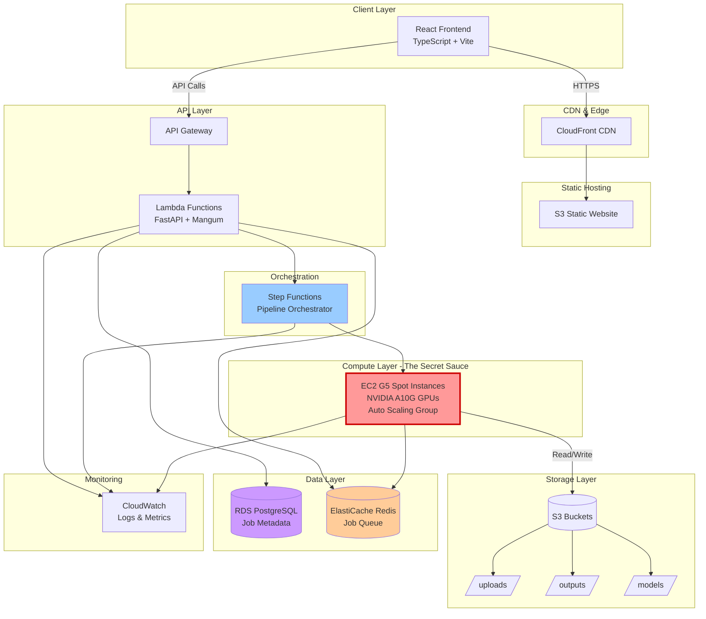
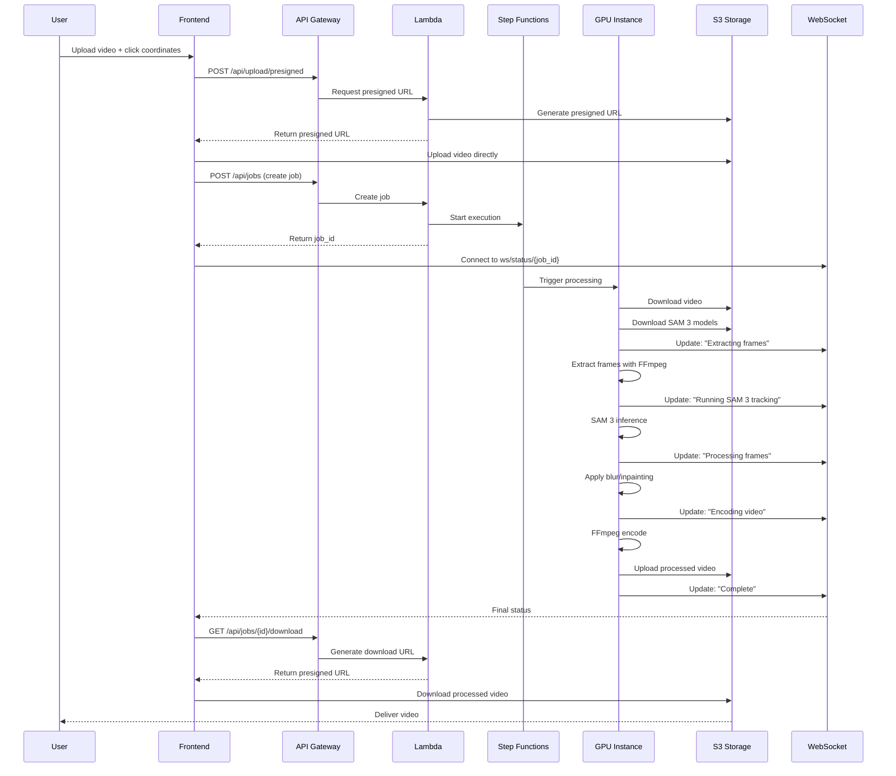

# TapMask AI - Technical Design Document

## Architecture Overview

TapMask AI leverages a **serverless-first, cloud-native architecture** on AWS, combining the scalability of managed services with the raw power of GPU compute for AI processing.

### Design Principles
- **Serverless Where Possible:** Minimize operational overhead
- **Cost-Optimized:** Spot instances and scale-to-zero
- **Security by Default:** Encryption, least privilege, auto-deletion
- **Horizontally Scalable:** Handle traffic spikes gracefully
- **Performance-First:** Sub-3-minute processing for typical videos

---

## System Architecture

### High-Level Architecture Diagram



---

## Component Specifications

### 1. Frontend Layer

#### Technology Stack
- **Framework:** React 18 with TypeScript
- **Build Tool:** Vite 5.x (fast HMR, optimized builds)
- **Video Player:** Plyr.js 3.x
- **State Management:** Zustand (lightweight)
- **HTTP Client:** Axios with retry logic
- **WebSocket:** Native WebSocket API with reconnection

#### Key Components
```typescript
// Component Structure
src/
├── components/
│   ├── VideoUploader.tsx
│   ├── VideoPlayer.tsx
│   ├── ObjectSelector.tsx
│   ├── ProcessingStatus.tsx
│   └── DownloadManager.tsx
├── hooks/
│   ├── useWebSocket.ts
│   ├── useVideoUpload.ts
│   └── useProcessingStatus.ts
├── services/
│   ├── api.ts
│   └── websocket.ts
└── types/
    └── index.ts
```

#### Hosting
- **Primary:** S3 bucket configured for static website hosting
- **CDN:** CloudFront distribution
  - Edge locations: Global
  - Cache TTL: 1 hour for assets, no-cache for index.html
  - Compression: Gzip + Brotli
  - SSL/TLS: Certificate via ACM

---

### 2. API Layer

#### AWS API Gateway
- **Type:** HTTP API (cheaper, faster than REST API)
- **Authentication:** API Key for rate limiting
- **CORS:** Configured for frontend domain
- **Throttling:** 1000 requests/second burst, 500 steady-state

#### Lambda Functions (FastAPI + Mangum)

**Runtime Configuration:**
- **Language:** Python 3.11
- **Memory:** 1024 MB
- **Timeout:** 30 seconds
- **Adapter:** Mangum (ASGI to Lambda adapter)

**API Endpoints:**

| Endpoint                  | Method | Purpose                   | Auth    |
| ---------------------------| --------| ---------------------------| ---------|
| `/api/upload/presigned`   | POST   | Generate S3 presigned URL | API Key |
| `/api/jobs`               | POST   | Create processing job     | API Key |
| `/api/jobs/{id}`          | GET    | Get job status            | API Key |
| `/api/jobs/{id}/download` | GET    | Get download URL          | API Key |
| `/api/health`             | GET    | Health check              | None    |
| `/ws/status/{job_id}`     | WS     | Real-time updates         | Token   |

**Lambda Function Structure:**
```python
# lambda_handler.py
from fastapi import FastAPI
from mangum import Mangum

app = FastAPI()

@app.post("/api/jobs")
async def create_job(request: JobRequest):
    # Vali  SAM3Track --> Failed: Tracking Error
    ProcessFrames --> Failed: Processing Error
    EncodeVideo --> Failed: Encoding Error
    Failed --> [*]
```

#### Step Function Definition (Simplified)
```json
{
  "Comment": "TapMask AI Processing Pipeline",
  "StartAt": "ValidateInput",
  "States": {
    "ValidateInput": {
      "Type": "Task",
      "Resource": "arn:aws:lambda:validate",
      "Next": "ExtractFrames"
    },
    "ExtractFrames": {
      "Type": "Task",
      "Resource": "arn:aws:lambda:extract",
      "Next": "SAM3Track"
    },
    "SAM3Track": {
      "Type": "Task",
      "Resource": "arn:aws:states:ecs:runTask.sync",
      "Parameters": {
        "Cluster": "gpu-cluster",
        "TaskDefinition": "sam3-tracker"
      },
      "Next": "ProcessFrames"
    },
    "ProcessFrames": {
      "Type": "Task",
      "Resource": "arn:aws:states:ecs:runTask.sync",
      "Next": "EncodeVideo"
    },
    "EncodeVideo": {
      "Type": "Task",
      "Resource": "arn:aws:lambda:encode",
      "Next": "Cleanup"
    },
    "Cleanup": {
      "Type": "Task",
      "Resource": "arn:aws:lambda:cleanup",
      "End": true
    }
  }
}
```

---

### 4. Compute Layer - The "Secret Sauce"

#### EC2 G5 Spot Instances

**Why G5 Spot Instances?**
- **GPU:** NVIDIA A10G Tensor Core GPU (24GB VRAM)
- **Cost:** ~$0.60/hour spot vs $1.00/hour on-demand (40% savings)
- **Performance:** Perfect for SAM 3 + ProPainter inference
- **Availability:** High spot availability in us-east-1

**Instance Configuration:**
- **Instance Type:** g5.xlarge
- **vCPUs:** 4
- **RAM:** 16 GB
- **GPU Memory:** 24 GB
- **Storage:** 200 GB gp3 EBS (for model caching)

**Auto Scaling Group Configuration:**
```yaml
AutoScalingGroup:
  MinSize: 0  # Scale to zero when idle
  MaxSize: 10  # Handle up to 10 concurrent videos
  DesiredCapacity: 0
  
  ScalingPolicies:
    - Type: TargetTrackingScaling
      TargetValue: 5  # Queue depth
      MetricName: ApproximateNumberOfMessagesVisible
      Namespace: AWS/SQS
```

**Cost Comparison:**
| Approach | Cost per Video | Monthly Cost (100 videos) |
|----------|---------------|---------------------------|
| Lambda + Fargate | $1.00 | $100 |
| EC2 On-Demand | $0.50 | $50 |
| **EC2 G5 Spot** | **$0.30** | **$30** |

#### Docker Container (Running on EC2)
```dockerfile
FROM nvidia/cuda:12.1.0-cudnn8-runtime-ubuntu22.04

# Install Python 3.11
RUN apt-get update && apt-get install -y python3.11 python3-pip

# Install dependencies
COPY requirements.txt .
RUN pip install torch torchvision --index-url https://download.pytorch.org/whl/cu121
RUN pip install opencv-python-headless segment-anything-3 propainter

# Copy processing scripts
COPY process_video.py /app/
WORKDIR /app

CMD ["python3", "process_video.py"]
```

---

### 5. Storage Layer

#### S3 Bucket Structure

**Bucket: `tapmask-uploads`**
- **Purpose:** Store original uploaded videos
- **Lifecycle Policy:** Delete after 24 hours
- **Encryption:** AES-256 (SSE-S3)
- **Versioning:** Disabled
- **Public Access:** Blocked

**Bucket: `tapmask-outputs`**
- **Purpose:** Store processed videos
- **Lifecycle Policy:** Delete after 24 hours (Free), 7 days (Pro)
- **Encryption:** AES-256 (SSE-S3)
- **Presigned URLs:** 1-hour expiry

**Bucket: `tapmask-models`**
- **Purpose:** Cache SAM 3 and ProPainter model weights
- **Size:** ~5 GB
- **Lifecycle:** Never delete
- **Access:** EC2 instances only (IAM role)

#### S3 Lifecycle Policy Example
```json
{
  "Rules": [
    {
      "Id": "DeleteUploadsAfter24Hours",
      "Status": "Enabled",
      "Prefix": "uploads/",
      "Expiration": {
        "Days": 1
      }
    },
    {
      "Id": "DeleteOutputsAfter24Hours",
      "Status": "Enabled",
      "Prefix": "outputs/free/",
      "Expiration": {
        "Days": 1
      }
    }
  ]
}
```

---

### 6. Data Layer

#### Amazon RDS (PostgreSQL 15)

**Instance Configuration:**
- **Instance Class:** db.t4g.micro (Free tier eligible)
- **Storage:** 20 GB gp3
- **Multi-AZ:** No (cost optimization)
- **Backup:** 7-day retention

**Database Schema:**

```sql
-- Jobs table
CREATE TABLE jobs (
    job_id UUID PRIMARY KEY DEFAULT gen_random_uuid(),
    user_id VARCHAR(255),  -- NULL for free tier
    video_filename VARCHAR(500) NOT NULL,
    s3_upload_key VARCHAR(500) NOT NULL,
    s3_output_key VARCHAR(500),
    click_x INTEGER NOT NULL,
    click_y INTEGER NOT NULL,
    processing_mode VARCHAR(20) NOT NULL,  -- 'privacy' or 'magic_eraser'
    status VARCHAR(50) NOT NULL,  -- 'pending', 'processing', 'completed', 'failed'
    created_at TIMESTAMP DEFAULT NOW(),
    started_at TIMESTAMP,
    completed_at TIMESTAMP,
    error_message TEXT,
    video_duration_seconds INTEGER,
    processing_time_seconds INTEGER,
    tier VARCHAR(10) DEFAULT 'free'  -- 'free' or 'pro'
);

CREATE INDEX idx_jobs_status ON jobs(status);
CREATE INDEX idx_jobs_user_id ON jobs(user_id);
CREATE INDEX idx_jobs_created_at ON jobs(created_at);

-- Usage tracking for free tier
CREATE TABLE usage_tracking (
    user_ip VARCHAR(45) PRIMARY KEY,
    videos_processed_this_month INTEGER DEFAULT 0,
    last_reset_date DATE DEFAULT CURRENT_DATE
);
```

#### Amazon ElastiCache (Redis 7)

**Cluster Configuration:**
- **Node Type:** cache.t4g.micro
- **Nodes:** 1 (no replication for cost savings)
- **Engine:** Redis 7.0

**Use Cases:**
1. **Job Queue:** Pending jobs waiting for GPU processing
2. **Rate Limiting:** Track API calls per IP
3. **WebSocket Sessions:** Store active WebSocket connections
4. **Caching:** Frequently accessed job statuses

**Redis Data Structures:**
```python
# Job queue (List)
LPUSH processing_queue job_id_123

# Job status cache (Hash)
HSET job:job_id_123 status "processing" progress 45

# Rate limiting (String with TTL)
INCR ratelimit:192.168.1.1
EXPIRE ratelimit:192.168.1.1 3600

# WebSocket sessions (Set)
SADD websocket:job_id_123 connection_id_456
```

---

## Processing Pipeline Details

### Step-by-Step Flow



### Processing Scripts (Python)

**Main Processing Script:**
```python
# process_video.py
import cv2
import torch
from segment_anything_3 import SAM3
from propainter import ProPainter
import boto3
import redis

def process_video(job_id, s3_key, click_x, click_y, mode):
    # Initialize
    s3 = boto3.client('s3')
    redis_client = redis.Redis(host='elasticache-endpoint')
    
    # Download video
    update_status(redis_client, job_id, "Downloading video")
    local_path = f"/tmp/{job_id}.mp4"
    s3.download_file('tapmask-uploads', s3_key, local_path)
    
    # Extract frames
    update_status(redis_client, job_id, "Extracting frames")
    frames = extract_frames(local_path)
    
    # Initialize SAM 3
    update_status(redis_client, job_id, "Loading SAM 3 model")
    sam3 = SAM3.from_pretrained("/models/sam3_large.pth")
    sam3.to('cuda')
    
    # Track object
    update_status(redis_client, job_id, "Tracking object")
    masks = sam3.track(frames, click_point=(click_x, click_y))
    
    # Process based on mode
    if mode == 'privacy':
        update_status(redis_client, job_id, "Applying blur")
        processed_frames = apply_gaussian_blur(frames, masks, kernel_size=99)
    else:  # magic_eraser
        update_status(redis_client, job_id, "Running ProPainter")
        propainter = ProPainter.from_pretrained("/models/propainter.pth")
        processed_frames = propainter.inpaint(frames, masks)
    
    # Encode video
    update_status(redis_client, job_id, "Encoding video")
    output_path = f"/tmp/{job_id}_output.mp4"
    encode_video(processed_frames, output_path)
    
    # Upload to S3
    update_status(redis_client, job_id, "Uploading result")
    output_key = f"outputs/{job_id}.mp4"
    s3.upload_file(output_path, 'tapmask-outputs', output_key)
    
    # Cleanup
    os.remove(local_path)
    os.remove(output_path)
    
    return output_key
```

---

## Monitoring & Observability

### CloudWatch Metrics

**Custom Metrics:**
- `ProcessingDuration` (seconds)
- `QueueDepth` (count)
- `GPUUtilization` (percentage)
- `CostPerVideo` (USD)
- `SuccessRate` (percentage)

**Alarms:**
- Queue depth > 20 for 5 minutes → Scale up
- Error rate > 5% → SNS notification
- Processing time > 10 minutes → Investigation alert

### Logging Strategy
```python
import logging
import json

logger = logging.getLogger()
logger.setLevel(logging.INFO)

def log_structured(event, context, **kwargs):
    log_entry = {
        "timestamp": datetime.utcnow().isoformat(),
        "request_id": context.request_id,
        "event": event,
        **kwargs
    }
    logger.info(json.dumps(log_entry))
```

---

## Cost Estimation

### Monthly Cost Breakdown (1000 videos/month)

| Service            | Usage           | Unit Cost     | Monthly Cost |
| --------------------| -----------------| ---------------| --------------|
| **CloudFront**     | 100 GB transfer | $0.085/GB     | $8.50        |
| **S3 Storage**     | 50 GB average   | $0.023/GB     | $1.15        |
| **API Gateway**    | 10K requests    | $1.00/million | $0.01        |
| **Lambda**         | 5K invocations  | $0.20/million | $0.001       |
| **Step Functions** | 1K executions   | $25/million   | $0.025       |
| **EC2 G5 Spot**    | 500 hours       | $0.60/hour    | $300.00      |
| **RDS PostgreSQL** | db.t4g.micro    | $13/month     | $13.00       |
| **ElastiCache**    | cache.t4g.micro | $11/month     | $11.00       |
| **Data Transfer**  | 200 GB out      | $0.09/GB      | $18.00       |
| **CloudWatch**     | Logs + metrics  | ~$5/month     | $5.00        |
| **TOTAL**          |                 |               | **$356.69**  |

**Cost per Video:** $0.36  
**Revenue per Pro User:** $9.99  
**Break-even:** 36 videos/month per Pro user

---

## Security Architecture

### IAM Roles & Policies

**Lambda Execution Role:**
```json
{
  "Version": "2012-10-17",
  "Statement": [
    {
      "Effect": "Allow",
      "Action": [
        "s3:GetObject",
      "s3:GetObject",
        "s3:PutObject"
      ],
      "Resource": [
        "arn:aws:s3:::tapmask-uploads/*",
        "arn:aws:s3:::tapmask-outputs/*",
        "arn:aws:s3:::tapmask-models/*"
      ]
    }
  ]
}
```

### Network Security

**VPC Configuration:**
- Private subnets for RDS and ElastiCache
- Public subnets for EC2 (with Elastic IPs)
- NAT Gateway for outbound internet access
- Security groups with least privilege

**Security Group Rules:**
```yaml
EC2SecurityGroup:
  Ingress:
    - Port: 22 (SSH) - Admin IP only
  Egress:
    - Port: 443 (HTTPS) - All destinations
    - Port: 5432 (PostgreSQL) - RDS security group
    - Port: 6379 (Redis) - ElastiCache security group

RDSSecurityGroup:
  Ingress:
    - Port: 5432 - EC2 + Lambda security groups
  Egress: None

ElastiCacheSecurityGroup:
  Ingress:
    - Port: 6379 - EC2 + Lambda security groups
  Egress: None
```

---

## Deployment Strategy

### Infrastructure as Code (Terraform)

```hcl
# main.tf
terraform {
  required_providers {
    aws = {
      source  = "hashicorp/aws"
      version = "~> 5.0"
    }
  }
}

provider "aws" {
  region = "us-east-1"
}

# S3 Buckets
resource "aws_s3_bucket" "uploads" {
  bucket = "tapmask-uploads"
  
  lifecycle_rule {
    enabled = true
    expiration {
      days = 1
    }
  }
}

# Auto Scaling Group for GPU instances
resource "aws_autoscaling_group" "gpu_workers" {
  name                = "tapmask-gpu-workers"
  min_size            = 0
  max_size            = 10
  desired_capacity    = 0
  vpc_zone_identifier = [aws_subnet.private.id]
  
  mixed_instances_policy {
    instances_distribution {
      on_demand_base_capacity                  = 0
      on_demand_percentage_above_base_capacity = 0
      spot_allocation_strategy                 = "capacity-optimized"
    }
    
    launch_template {
      launch_template_specification {
        launch_template_id = aws_launch_template.gpu_worker.id
        version            = "$Latest"
      }
      
      override {
        instance_type = "g5.xlarge"
      }
    }
  }
}
```

### CI/CD Pipeline

**GitHub Actions Workflow:**
```yaml
name: Deploy TapMask AI

on:
  push:
    branches: [main]

jobs:
  deploy-frontend:
    runs-on: ubuntu-latest
    steps:
      - uses: actions/checkout@v3
      - name: Build React app
        run: |
          cd frontend
          npm install
          npm run build
      - name: Deploy to S3
        run: aws s3 sync frontend/dist s3://tapmask-frontend
      - name: Invalidate CloudFront
        run: aws cloudfront create-invalidation --distribution-id ${{ secrets.CF_DIST_ID }} --paths "/*"
  
  deploy-backend:
    runs-on: ubuntu-latest
    steps:
      - uses: actions/checkout@v3
      - name: Package Lambda
        run: |
          cd backend
          pip install -r requirements.txt -t .
          zip -r lambda.zip .
      - name: Deploy Lambda
        run: aws lambda update-function-code --function-name tapmask-api --zip-file fileb://lambda.zip
  
  build-gpu-image:
    runs-on: ubuntu-latest
    steps:
      - uses: actions/checkout@v3
      - name: Build Docker image
        run: docker build -t tapmask-gpu:latest gpu/
      - name: Push to ECR
        run: |
          aws ecr get-login-password | docker login --username AWS --password-stdin ${{ secrets.ECR_REGISTRY }}
          docker tag tapmask-gpu:latest ${{ secrets.ECR_REGISTRY }}/tapmask-gpu:latest
          docker push ${{ secrets.ECR_REGISTRY }}/tapmask-gpu:latest
```

---

## Scalability Considerations

### Horizontal Scaling
- **API Layer:** Lambda auto-scales to 1000 concurrent executions
- **Compute Layer:** ASG scales from 0 to 10 GPU instances
- **Database:** Read replicas can be added if needed
- **Cache:** Redis cluster mode for sharding

### Vertical Scaling Options
- Upgrade to g5.2xlarge (2x GPU performance) for 4K videos
- Increase Lambda memory for faster cold starts
- Use RDS Proxy for connection pooling

### Global Expansion
- Deploy CloudFront edge locations globally
- Multi-region S3 buckets with cross-region replication
- Regional GPU clusters (us-east-1, eu-west-1, ap-southeast-1)

---

## Success Metrics

### Technical KPIs
- 99.5% uptime
- < 3 minute average processing time
- < $0.40 cost per video
- < 200ms API response time
- 95%+ GPU utilization during processing

### Business KPIs
- 1000+ videos processed in first month
- 10% free-to-pro conversion rate
- $500+ MRR by month 3
- 4.5+ star user rating

---

**Document Version:** 1.0  
**Last Updated:** February 15, 2026  
**Architecture Status:** Production-Ready  
**Estimated Implementation Time:** 2 weeks (hackathon sprint)
