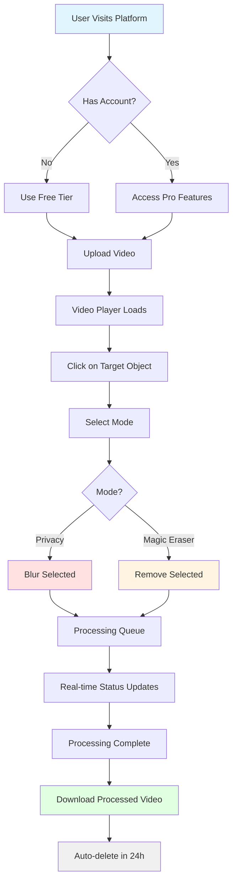

# TapMask AI - Requirements Specification

## Project Overview

**TapMask AI** is a serverless, cloud-native video privacy and editing platform that enables users to upload videos, click on a face or object once, and automatically track and process that object throughout the entire video.

### Core Value Proposition

> **"Professional video masking in one click. Privacy protection meets content removal—powered by AI."**

**Hackathon Track:** AI for Media, Content & Digital Experiences

---

## Functional Requirements

### 1. Dual AI Processing Modes

#### Privacy Mode
- **Purpose:** Protect identities and sensitive information in videos
- **Technology Stack:**
  - **Meta SAM 3** (Segment Anything Model 3) for zero-shot object tracking
  - **OpenCV** for Gaussian blur processing
- **Processing Parameters:**
  - Kernel Size: **99x99** for maximum privacy
  - Real-time mask propagation across all frames
  - Maintains temporal consistency throughout video

#### Magic Eraser Mode
- **Purpose:** Complete object removal with intelligent background reconstruction
- **Technology Stack:**
  - **Meta SAM 3** for precise object segmentation and tracking
  - **ProPainter** for flow-guided video inpainting
- **Capabilities:**
  - Removes objects entirely from video
  - Reconstructs background using temporal flow analysis
  - Maintains visual coherence and natural appearance
  - Handles complex scenes with camera motion

---

### 2. User Interface & Experience

#### Interactive Video Player
- **Framework:** HTML5 video player powered by **Plyr.js**
- **Features:**
  - Smooth playback controls
  - Frame-by-frame navigation
  - Timeline scrubbing
  - Fullscreen support

#### Click-to-Select Interface
- **Interaction Model:**
  - Single-click selection on target object
  - Captures precise (x, y) coordinates
  - Visual feedback on selection
  - Preview of initial segmentation mask
- **User Flow:**
  1. Upload video file
  2. Click on target face/object in first frame
  3. Select processing mode (Privacy or Magic Eraser)
  4. Confirm and submit job

#### Real-Time Status Updates
- **Technology:** WebSocket connection
- **Status Events:**
  - Upload progress (0-100%)
  - Processing stages:
    - Validation complete
    - Frame extraction in progress
    - AI tracking active
    - Processing frames
    - Encoding final video
  - Estimated time remaining
  - Completion notification with download link

---

### 3. Privacy & Security Requirements

#### Data Protection

**No User Accounts Required (Free Tier)**
- Anonymous usage for basic features
- No personal information collection
- Session-based tracking only

**Auto-Deletion Policy**
- **24-Hour Hard Delete:** All uploads and outputs automatically deleted from S3
- **Implementation:** S3 Lifecycle Policy
- **Scope:** Applies to:
  - Original uploaded videos (`/uploads`)
  - Processed output videos (`/outputs`)
  - Temporary processing artifacts

**Compliance Standards**
- **GDPR Compliant:** Right to erasure built-in
- **COPPA Compliant:** No data collection from minors
- **Data Minimization:** Only essential metadata stored
- **Encryption:** Data encrypted at rest (S3) and in transit (TLS 1.3)

#### Security Measures
- Input validation and sanitization
- File type verification (video formats only)
- Size limits enforcement
- Rate limiting per IP address
- Secure presigned URLs for uploads/downloads (1-hour expiry)

---

### 4. Monetization Strategy (Freemium Model)

#### Free Tier
| Feature | Specification |
|---------|--------------|
| **Videos per Month** | 3 videos |
| **Processing Mode** | Privacy Mode (Blur) only |
| **Output Quality** | 1080p maximum |
| **Watermark** | TapMask AI logo overlay |
| **Processing Priority** | Standard queue |
| **Storage Duration** | 24 hours |

#### Pro Tier ($9.99/month)
| Feature | Specification |
|---------|--------------|
| **Videos per Month** | Unlimited |
| **Processing Modes** | Privacy Mode + Magic Eraser Mode |
| **Output Quality** | Up to 4K (3840x2160) |
| **Watermark** | None |
| **Processing Priority** | Priority queue (2x faster) |
| **Storage Duration** | 7 days |
| **Additional Features** | Batch processing, API access |

---

## Video Processing Requirements

### Supported Input Formats
- **Video Codecs:** H.264, H.265 (HEVC), VP9, AV1
- **Container Formats:** MP4, MOV, AVI, MKV, WebM
- **Resolution Range:** 480p to 4K (Pro tier)
- **Frame Rates:** 24fps, 25fps, 30fps, 60fps
- **Maximum File Size:**
  - Free: 500 MB
  - Pro: 5 GB

### Output Specifications
- **Video Codec:** H.264 (High Profile)
- **Container:** MP4
- **Audio:** AAC, 128 kbps stereo
- **Bitrate:** Adaptive based on resolution
  - 1080p: 8 Mbps
  - 4K: 20 Mbps

---

## User Flow Diagram

---

## Performance Requirements

### Processing Speed Targets
| Video Length | Target Processing Time | Maximum Time |
|--------------|----------------------|--------------|
| 30 seconds | 45 seconds | 90 seconds |
| 1 minute | 90 seconds | 3 minutes |
| 5 minutes | 7 minutes | 12 minutes |
| 10 minutes | 15 minutes | 25 minutes |

### System Availability
- **Uptime Target:** 99.5%
- **Maximum Downtime:** 3.6 hours/month
- **Response Time:** < 200ms for API calls
- **WebSocket Latency:** < 100ms for status updates

---

## Browser & Device Support

### Supported Browsers
- Chrome 90+ (Recommended)
- Firefox 88+
- Safari 14+
- Edge 90+

### Device Compatibility
- Desktop (Windows, macOS, Linux)
- Mobile (iOS 14+, Android 10+)
- Tablet (iPad, Android tablets)

---

## Analytics & Monitoring Requirements

### User Metrics
- Total videos processed
- Processing mode distribution (Privacy vs Magic Eraser)
- Average processing time
- User retention rate
- Conversion rate (Free to Pro)

### System Metrics
- API response times
- Processing queue depth
- GPU utilization
- Error rates by stage
- Cost per video processed

---

## Success Criteria

### Hackathon Judging Criteria
1. **Innovation:** Novel application of SAM 3 + ProPainter
2. **Technical Excellence:** Serverless architecture with GPU compute
3. **User Experience:** One-click simplicity
4. **Business Viability:** Clear monetization strategy
5. **Social Impact:** Privacy protection and content moderation tools

### Key Performance Indicators (KPIs)
- Process 100+ videos during demo
- < 2 minute average processing time
- 95%+ successful processing rate
- Zero data breaches or privacy incidents
- Positive user feedback (4+ stars)

---

## Future Enhancements (Post-Hackathon)

### Phase 2 Features
- Multiple object selection in single video
- Custom blur intensity controls
- Shape-based masking (rectangle, circle, polygon)
- Batch processing interface
- API for third-party integrations

### Phase 3 Features
- Automatic face detection (no click required)
- Style transfer for masked regions
- Mobile native apps (iOS/Android)
- Multi-language support
- Educational content moderation tools

---

**Document Version:** 1.0  
**Last Updated:** February 15, 2026  
**Status:** Ready for Implementation
